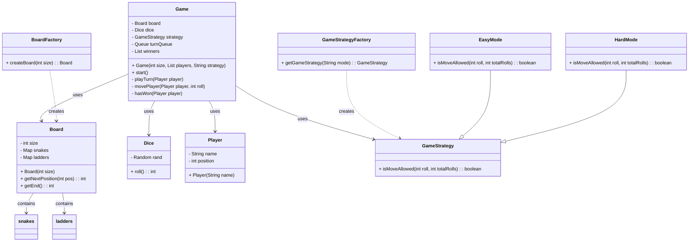

# Snake and Ladder UML Diagram

```mermaid
classDiagram
    class Game {
        - Board board
        - Dice dice
        - GameStrategy strategy
        - Queue turnQueue
        - List winners
        + Game(int size, List players, String strategy)
        + start()
        - playTurn(Player player)
        - movePlayer(Player player, int roll)
        - hasWon(Player player)
    }

    class Board {
        - int size
        - Map snakes
        - Map ladders
        + Board(int size)
        + getNextPosition(int pos): int
        + getEnd(): int
    }

    class Dice {
        - Random rand
        + roll(): int
    }

    class Player {
        - String name
        - int position
        + Player(String name)
    }

    class BoardFactory {
        + createBoard(int size): Board
    }

    class GameStrategyFactory {
        + getGameStrategy(String mode): GameStrategy
    }

    class GameStrategy {
        + isMoveAllowed(int roll, int totalRolls): boolean
    }

    class EasyMode {
        + isMoveAllowed(int roll, int totalRolls): boolean
    }

    class HardMode {
        + isMoveAllowed(int roll, int totalRolls): boolean
    }

    Game --> Board : uses
    Game --> Dice : uses
    Game --> GameStrategy : uses
    Game --> Player : uses
    BoardFactory ..> Board : creates
    GameStrategyFactory ..> GameStrategy : creates
    EasyMode --|> GameStrategy
    HardMode --|> GameStrategy
    Board --> snakes : contains
    Board --> ladders : contains
```
